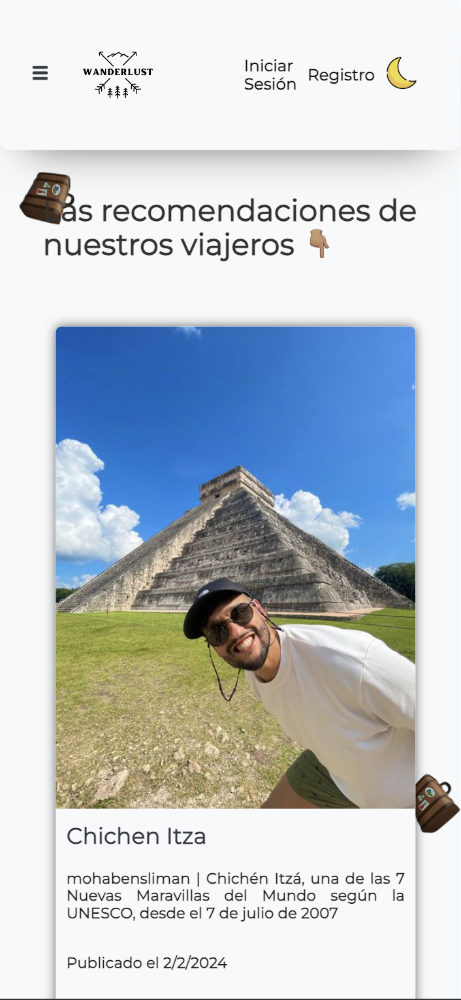
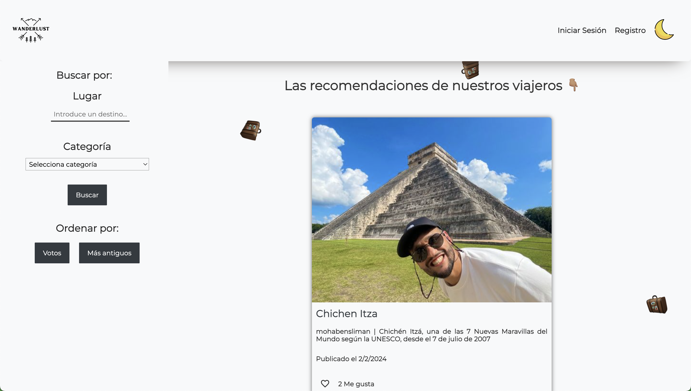
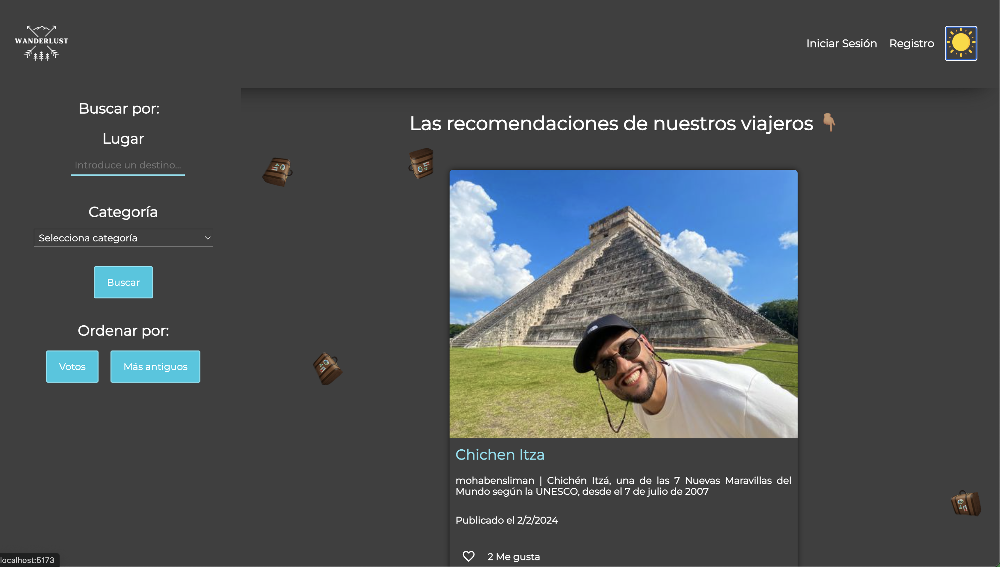

# Wanderlust 🗺️

Os presentamos Wanderlust, aquí podrás compartir tus recomendaciones y experiencias de viaje así como descubrir muchas otras de todos nuestros usuarios.

Como bien sabréis, "Wanderlust" es un término proveniente del alemán que significa "PASIÓN POR VIAJAR", siendo unos apasionados de los viajes y de descubrir nuevos lugares no hay mejor palabra que pueda representar nuestra esencia.

## 🌍 Sobre Wanderlust

Wanderlust es una red social pensada y diseñada para que entusiastas de la exploración compartan sus viajes, excursiones, experiencias, escapadas, trucos y rincones ocultos. Tanto si eres un trotamundos veterano como si estás buscando inspiración para tu siguiente escapada, plan, excursión, etc. En Wanderlust te esperan sugerencias genuinas de nuestros viajeros."

## 🛠️ Funciones Principales

### 🔓 Para todos los usuarios

- 🔍 Buscar publicaciones por lugar y categoría.
- 👍 Ordenar resultados de búsqueda por votos y fecha.
- 📖 Ver detalles de una publicación.
- 🔐 Iniciar sesión (con email y contraseña).
- 📝 Registro de usuarios (nombre, email y contraseña).

### 🔐 Para usuarios registrados

- ✍️ Publicar recomendaciones (título, categoría, lugar, corta descripción, larga descripción y foto).
- 🤍 Votar las publicaciones de otros usuarios.
- 🗑️ Borrar tus propias publicaciones.

## 🚀 Cómo Empezar

1. Clona este repositorio: `git clone https://github.com/crisky94/ProyectoBlogViajes.git`
2. Instala las dependencias en la carpeta api: `npm install`
3. Instala el workbench: `https://www.mysql.com/products/workbench/`
4. Crear tablas de la base de datos: `node ./src/db/initDB.js`
5. Ejecuta el servidor en la carpeta api: `npm run dev`
6. Instala las dependencias en la carpeta Frontend: `npm install`
7. Ejecuta el servidor en la carpeta Frontend: `npm run dev`

## 🔗 API y Endpoints

Puedes encontrar más detalles sobre la API y los endpoints en la carpeta de Api.

## 📸 Capturas de Pantalla

## 📝 Contribución

- [Germán Robles](https://github.com/GermanRoobles)
- [Cris Labrador](https://github.com/crisky94/)
- [Mohamed Bensliman](https://github.com/mohabensliman)
- [Jairo](https://github.com/jairoweb)

## 📞 Contacto

Si tienes alguna pregunta o comentario, no dudes en ponerte en contacto con nosotros en:

- [Germán Robles](https://www.linkedin.com/in/germanrobleslopez/)
- [Cris Labrador](https://www.linkedin.com/in/cristina-labrador-ordoñez/)
- [Mohamed Bensliman](https://www.linkedin.com/in/mohamedachrafbensliman/)
- [Jairo](https://www.linkedin.com/in/jairo-josue-delgado-hernandez/)

¡Esperamos que os guste la aplicación y que la disfrutéis tanto como nosotros haciéndola!

---

Hecho con mucho 🤍 por el equipo de Wanderlust
